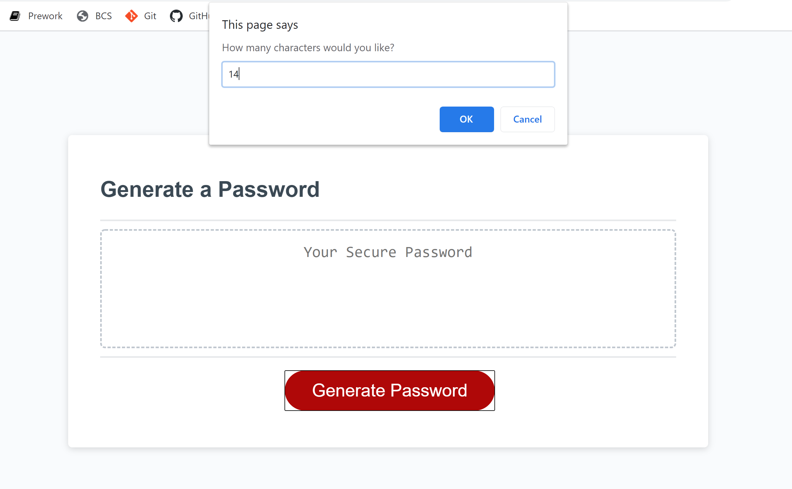
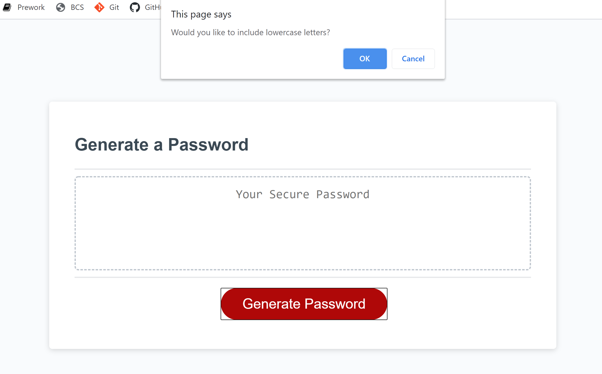
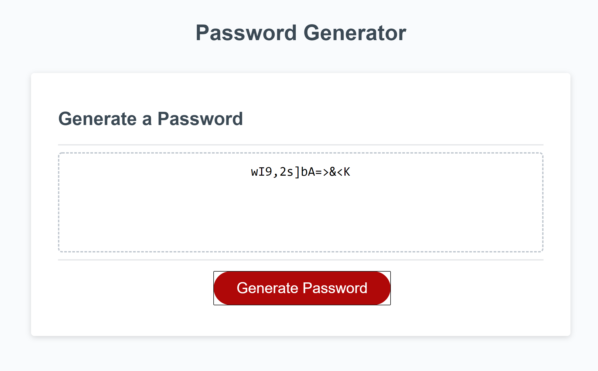

# Homework-3-JS

* program presents with a prompt asking for number of characters you want in your password
* prevents user from continuing without choosing a number between 8 and 128
* then prompts the user if they would like:
    * lowercase letters
    * uppercase letters
    * numbers
    * special characters
* allows password to be generated only if at least one of the character classes is selected
* the password is generated and printed into the password box
* below are some images of the project in action.

