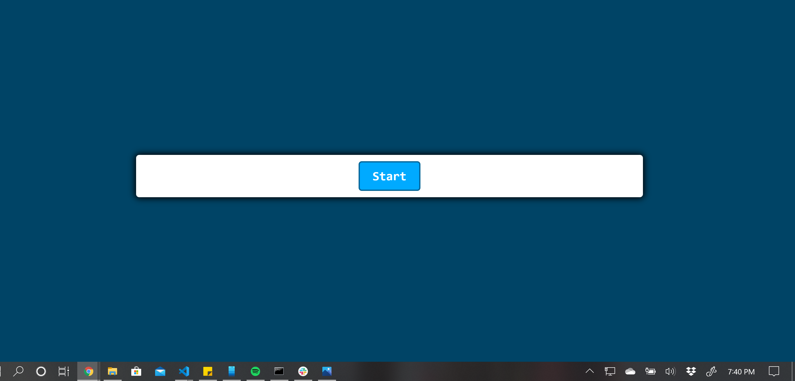
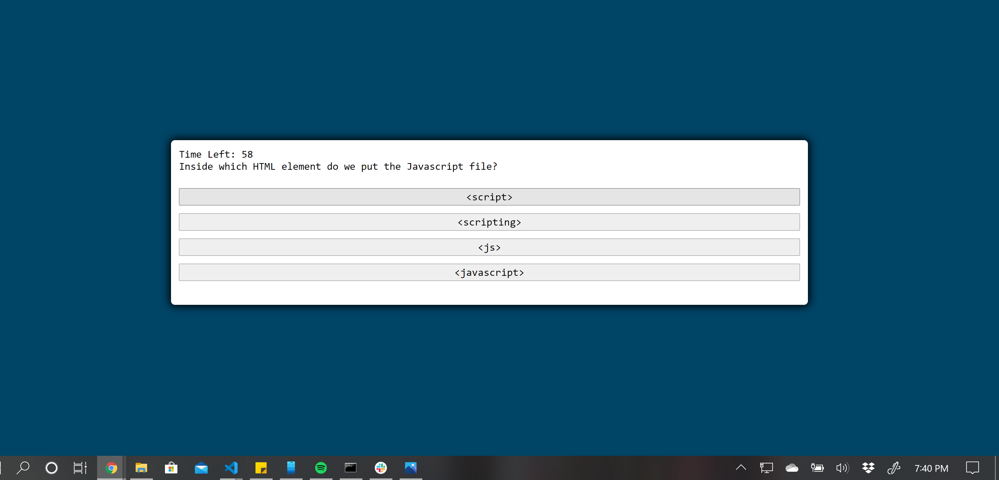
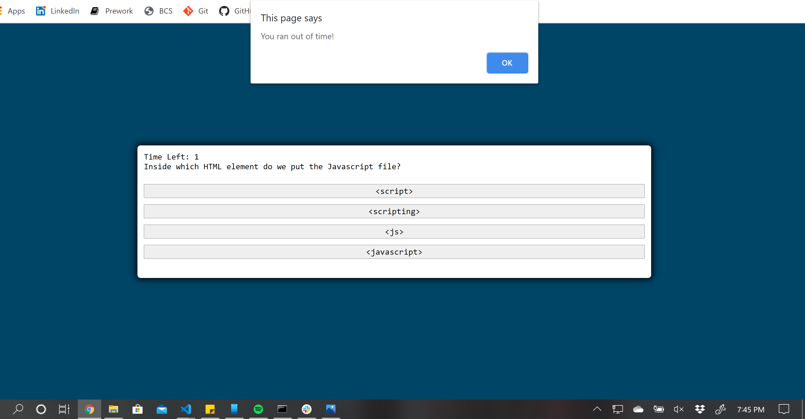

# Homework-4-CodeQuiz

* quiz starts when the start button is pushed
    * timer begins and first question is displayed
* when question is answered, an alert displays whether it's right or wrong
* when timer reaches 0, an alert box is displayed that reads out of time

* I didn't have time to finish the homework this week, I had already logged about 20 hours into it and couldn't figure out the rest on my own. I tried my best.

<a href = "celineross.github.io/Homework4CodeQuiz">Link to functioning site</a>